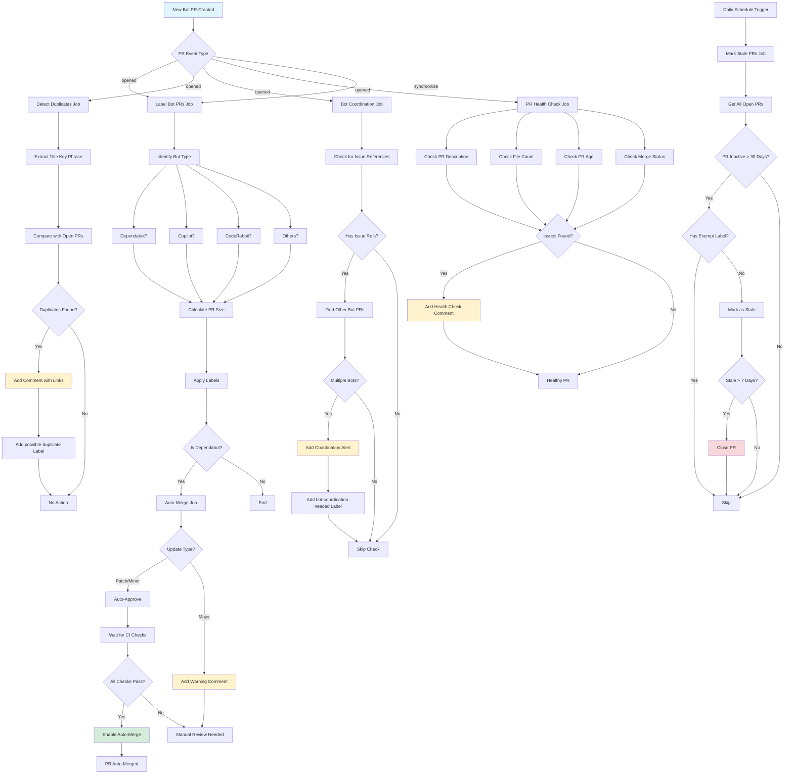
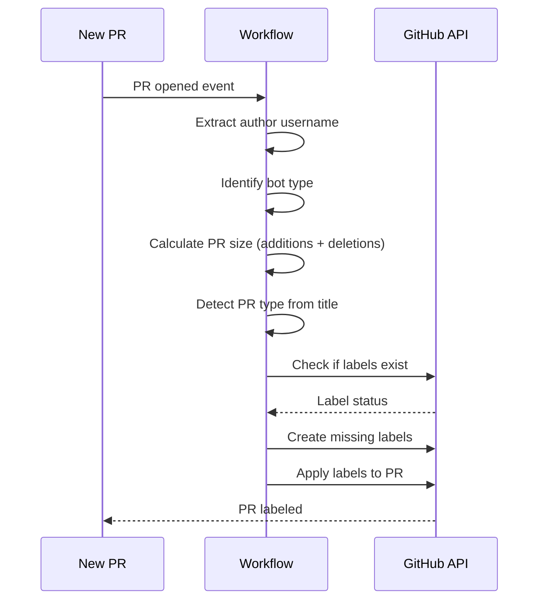
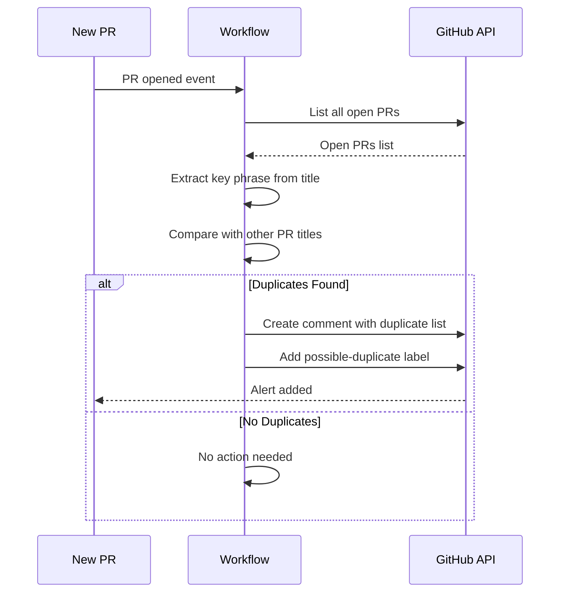
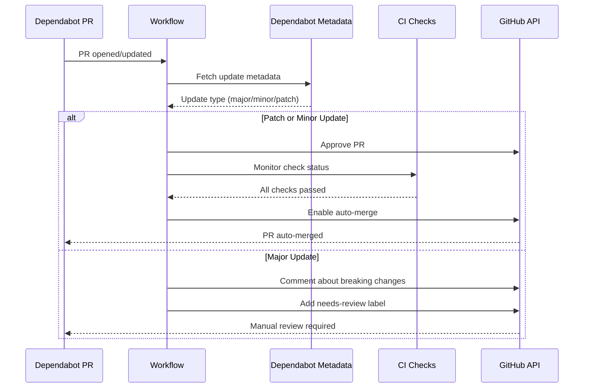
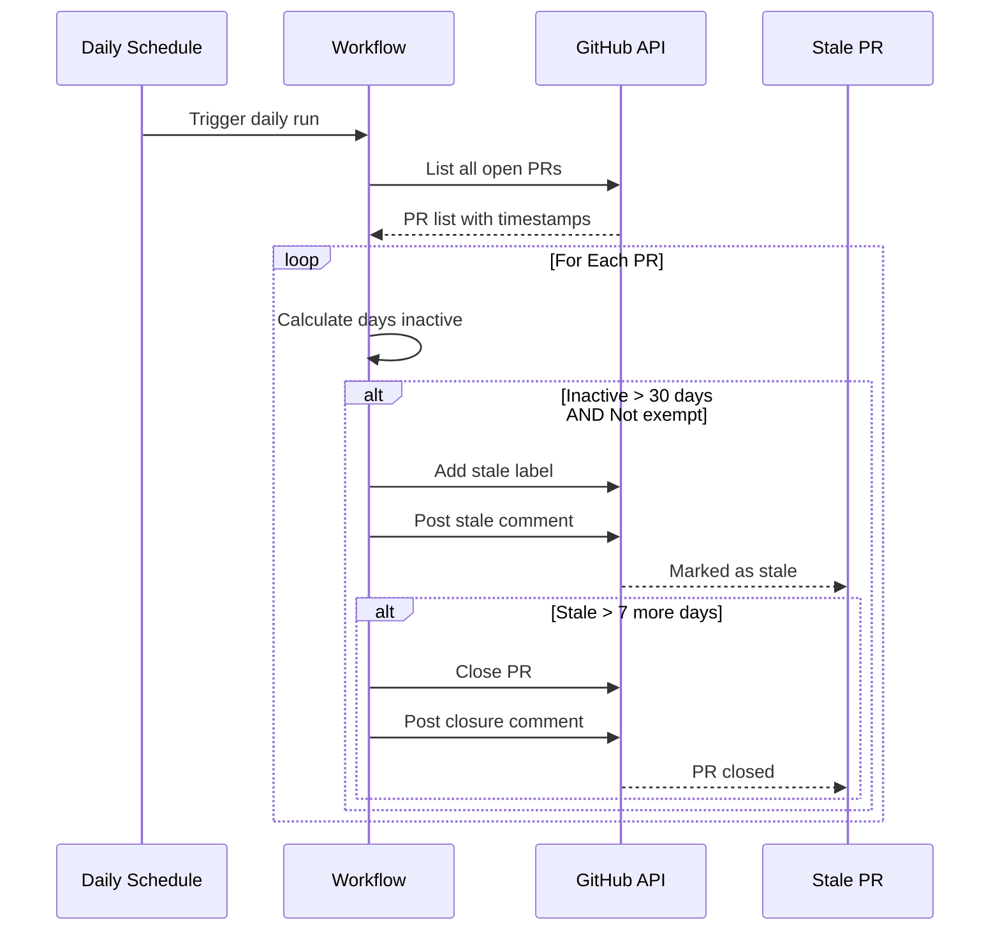
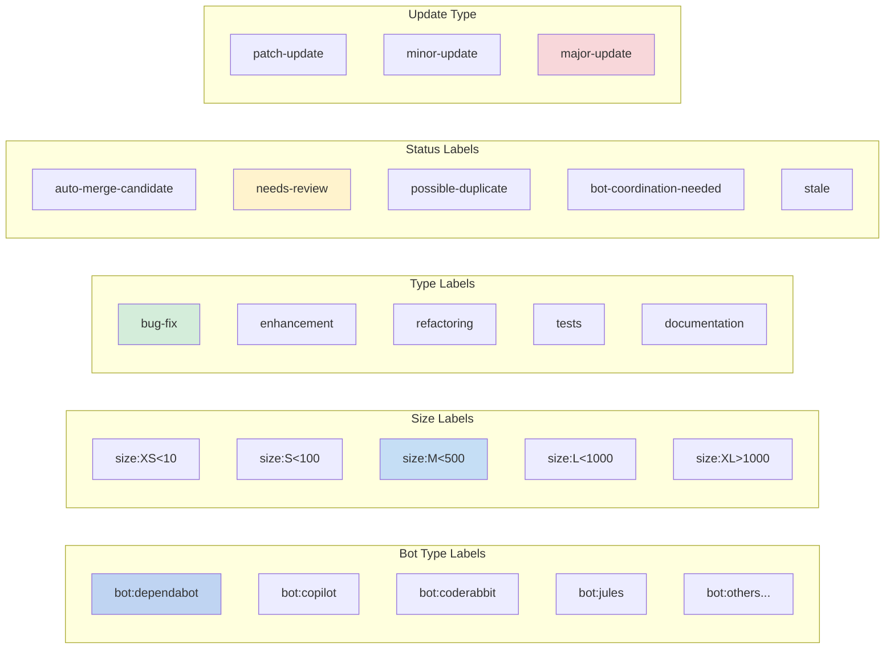
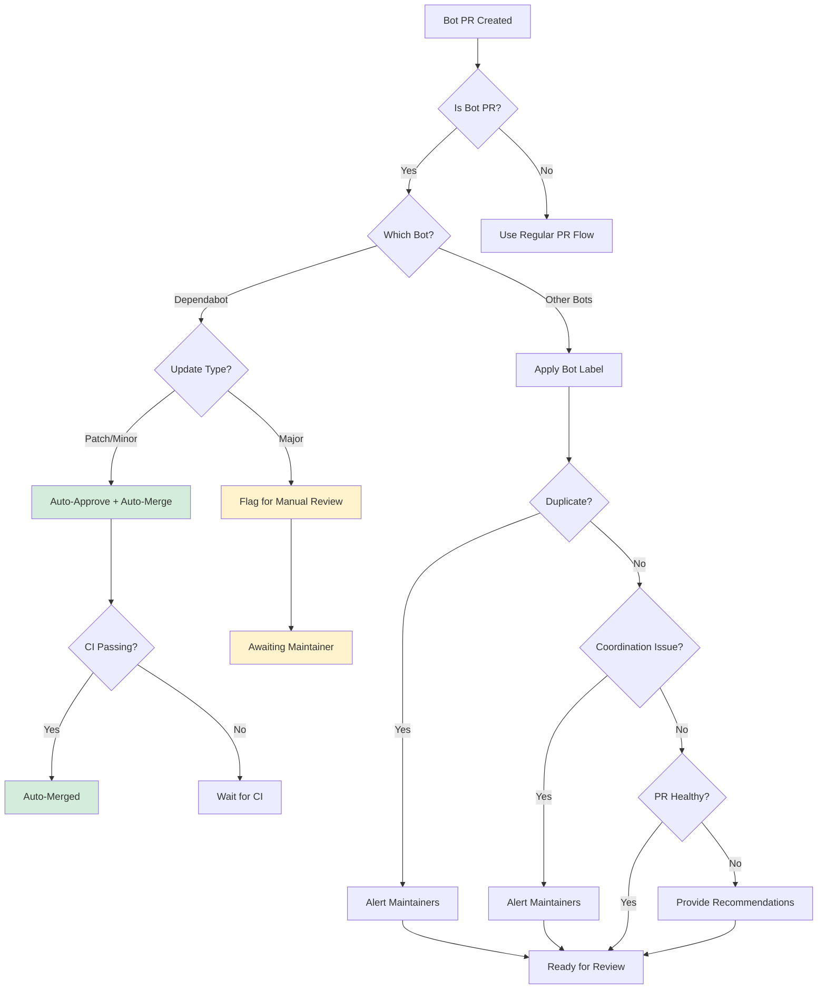
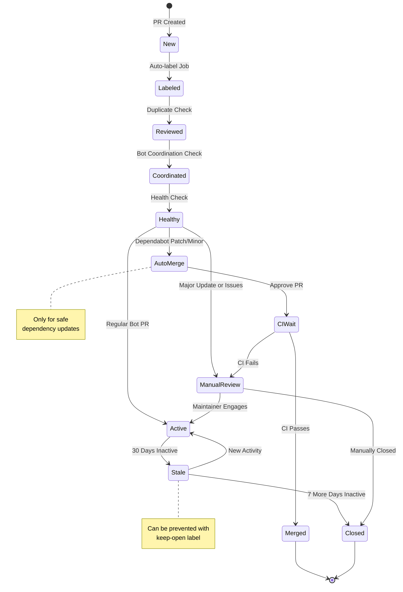
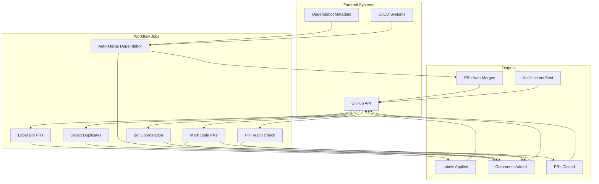
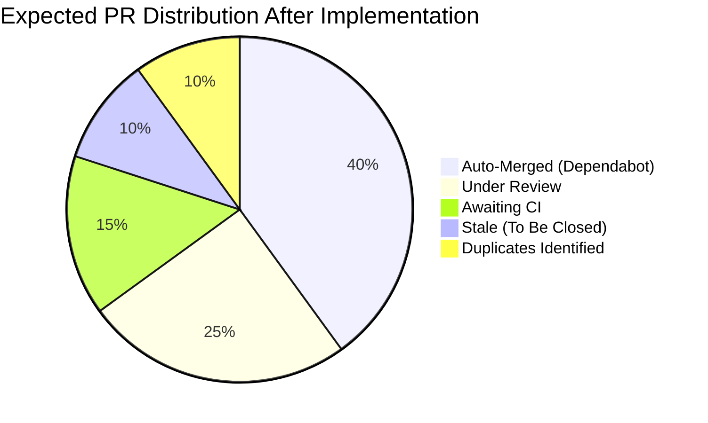

# Bot PR Management Workflow Diagram

## Overview Flowchart



## Job Flow Details

### 1. Label Bot PRs Flow



### 2. Duplicate Detection Flow



### 3. Dependabot Auto-Merge Flow



### 4. Stale PR Management Flow



## Label Hierarchy



## Decision Tree



## State Machine



## Integration Points



## Timeline

```mermaid
gantt
    title Bot PR Lifecycle Timeline
    dateFormat X
    axisFormat %d
    
    section PR Lifecycle
    PR Created           :a1, 0, 1d
    Auto-Labeled         :a2, 0, 1d
    Health Check         :a3, 0, 1d
    Duplicate Detection  :a4, 0, 1d
    Active State         :a5, 1, 29d
    Marked Stale         :milestone, m1, 30
    Grace Period         :a6, 30, 7d
    Auto-Closed          :milestone, m2, 37
    
    section Dependabot Only
    Auto-Approval        :b1, 0, 1d
    CI Checks            :b2, 0, 2d
    Auto-Merge           :milestone, m3, 2
```

## Success Metrics



---

*These diagrams illustrate the comprehensive bot PR management workflow implemented in `.github/workflows/bot-pr-management.yml`*
